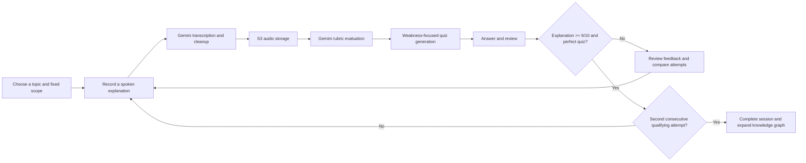
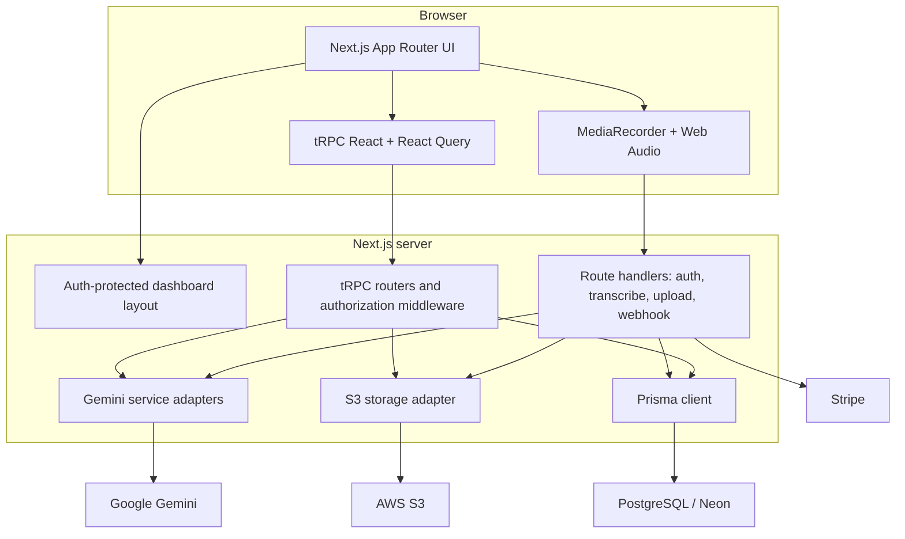
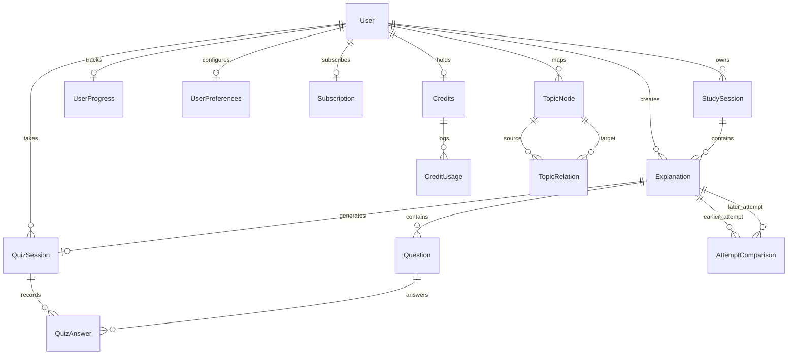

# Explain2Win

**Learn by teaching. Explain a topic aloud, receive AI feedback and a targeted quiz, then repeat until you can demonstrate mastery.**

Explain2Win is a full-stack learning application built around the Feynman Technique and active recall. Instead of treating reading or note-taking as evidence of understanding, it asks learners to teach a bounded topic in their own words. AI model transcribes and evaluates the explanation, generates questions around omissions and weak points, grades the answers, and tracks improvement across repeated attempts.

This repository is a working test-release implementation, not a production-ready SaaS. The core learning loop is reachable through the UI; several supporting screens and commercial features have substantial code behind them but are deliberately gated or incomplete. The [implementation status](#implementation-status) and [known gaps](#known-gaps-and-prioritized-next-steps) sections make that distinction explicit.

## Why this project exists

Passive familiarity is easy to mistake for mastery. Explain2Win makes understanding observable:

1. Define a topic and what a good explanation must cover.
2. Explain it aloud without relying on recognition cues.
3. Receive a rubric-based evaluation of correctness, clarity, depth, relevance, and structure.
4. Answer AI-generated questions focused on what the explanation missed or misunderstood.
5. Repeat against the same scope and compare attempts.
6. Master the study session after two consecutive qualifying attempts.

A qualifying attempt requires both an explanation score of at least **9/10** and a **perfect quiz**. Two consecutive qualifying attempts complete the study session and add the topic to the learner's knowledge graph.

## Core product flow



The scope belongs to the `StudySession`, not to an individual attempt. Topic and scope are immutable while a learner continues that session, which makes score changes and AI comparisons meaningful across attempts.

## What is implemented

### Learning and assessment

- Browser microphone capture using `MediaRecorder`, with a live Web Audio visualization and elapsed-time tracking.
- Authenticated audio transcription and cleanup through Gemini.
- Private audio upload to AWS S3; the database stores the object key and generates one-hour signed URLs for later playback.
- Scope-relative explanation evaluation across five weighted dimensions:
  - correctness: 35%
  - depth: 25%
  - clarity: 20%
  - relevance: 10%
  - structure: 10%
- Separate short feedback, detailed evidence-based feedback, strengths, improvements, missing concepts, and learning objectives.
- Gemini-generated multiple-choice and short-answer questions. Generation uses the evaluator's missing concepts and learning objectives when available.
- Exact normalized grading for multiple-choice answers and Gemini-based semantic grading for short answers.
- Per-question timing, immediate correctness feedback, completed-quiz review, and persisted answers.
- Multi-attempt study sessions with aggregate accuracy, total duration, mastery streaks, attempt history, radar charts, score deltas, transcript/audio comparison, and cached AI comparison analysis.

### Product shell and discovery

- Credentials registration and login with bcrypt password hashing.
- Optional Google and GitHub OAuth through Auth.js.
- Authenticated dashboard with active sessions, recently mastered topics, weekly explanation activity, and mastery statistics.
- Study-session list and detail screens.
- Interactive force-directed knowledge graph with mastered and AI-suggested topics.
- AI-generated scope suggestions when starting from a suggested graph node.
- Responsive dashboard shell, dark mode, animations, loading states, and toast feedback.

### Platform capabilities

- End-to-end typed application API with tRPC, React Query, SuperJSON, and Zod validation.
- PostgreSQL persistence through Prisma.
- User-scoped queries across most read and write paths.
- Credit ledger and subscription-tier model.
- Stripe checkout, customer portal, subscription lifecycle, invoice history, and signed webhook handlers.
- Security response headers for framing, MIME sniffing, and referrer behavior.
- A maintenance script for backfilling the knowledge graph from completed study sessions.

## Implementation status

The labels below describe what a user can reach in the current UI, not merely whether a source file exists.

| Area                                 | Status                                  | Evidence from the current implementation                                                                                                                 |
| ------------------------------------ | --------------------------------------- | -------------------------------------------------------------------------------------------------------------------------------------------------------- |
| Credentials authentication           | **Reachable**                           | Registration creates the user and associated progress, preferences, free subscription, and credit records; login uses JWT sessions.                      |
| Google/GitHub OAuth                  | **Conditional**                         | Providers are registered only when credentials exist, although both buttons are always rendered.                                                         |
| Dashboard                            | **Reachable**                           | Shows session-centric stats, recent activity, active work, and mastered sessions.                                                                        |
| Voice explanation pipeline           | **Reachable with services configured**  | Recording, two-pass transcription, S3 upload, persistence, credit charging, and evaluation are wired end to end.                                         |
| AI evaluation and feedback           | **Reachable with Gemini configured**    | Evaluation results are persisted on each explanation and shown in explanation/session views.                                                             |
| Quiz generation and completion       | **Reachable with Gemini configured**    | Five `CURIOUS` questions are requested by the current explain screen; the server supports 3–10 questions and four student personas.                      |
| Study sessions and repeated attempts | **Reachable**                           | Sessions preserve topic/scope, number attempts, aggregate results, and expose comparison tools.                                                          |
| Mastery workflow                     | **Reachable**                           | Quiz completion updates the two-attempt mastery streak and completes qualifying sessions.                                                                |
| Attempt comparison                   | **Reachable with Gemini/S3 configured** | Comparisons are generated for one credit, cached, and include score-dimension analysis and audio/transcript review.                                      |
| Knowledge graph                      | **Reachable**                           | Completed sessions create mastered nodes and Gemini-derived related-topic edges; suggested nodes can start a new session.                                |
| Credits                              | **Active backend, limited UI**          | Explanation, quiz, and comparison operations deduct credits, but the sidebar balance/upgrade panel is commented out. New users receive 500 test credits. |
| Progress analytics                   | **Implemented but gated/partial**       | The page and router exist, but `/progress` renders a Coming Soon layout and streak updates are not called by the active workflow.                        |
| Question bank                        | **Implemented but gated**               | Listing, search, and deletion exist, but `/question-bank` renders Coming Soon. Its revision CTA only starts a generic explanation.                       |
| Settings                             | **Implemented but gated**               | Profile and preference mutations exist, but `/settings` renders Coming Soon. Email notification preferences have no delivery service.                    |
| Stripe billing                       | **Backend implemented, UI gated**       | Checkout, portal, cancellation, invoices, and webhooks exist, but `/billing` renders Coming Soon and subscription UX is hidden.                          |
| Tier-specific personas               | **Server support only in current flow** | Tier rules support four personas, but the active explain page always requests `CURIOUS`.                                                                 |
| Retention and re-quiz rules          | **Declared only**                       | Tier audio-retention limits and `RE_QUIZ` cost constants exist but have no enforcing workflow.                                                           |

## Architecture

Explain2Win is a single Next.js application. The browser handles interactive recording and quiz state; Next.js route handlers handle binary uploads, authentication, and webhooks; tRPC owns the typed application domain; Prisma persists the state.



### Request boundaries

- **Auth.js route handler** — OAuth callbacks, credentials sessions, and JWT session enrichment.
- **`/api/auth/register`** — credentials-user creation and bootstrap records.
- **`/api/transcribe`** — authenticated multipart upload, audio validation, Gemini transcription, and Gemini cleanup.
- **`/api/upload`** — authenticated multipart upload to private S3 storage.
- **`/api/trpc/[trpc]`** — all application-domain reads and mutations.
- **`/api/webhooks/stripe`** — signed Stripe subscription and invoice events.

### tRPC domains

| Router           | Responsibility                                                                                         |
| ---------------- | ------------------------------------------------------------------------------------------------------ |
| `user`           | Profile, preferences, subscription context, credit balance, and usage history.                         |
| `dashboard`      | Session-centric summary statistics and seven-day activity.                                             |
| `studySession`   | Session creation, listing, detail aggregation, continuation, and manual completion.                    |
| `explanation`    | Attempt creation, credit deduction, AI evaluation, history, detail, and deletion.                      |
| `quiz`           | Question generation, answer submission/grading, quiz completion, and mastery updates.                  |
| `comparison`     | Ownership-checked attempt retrieval, signed audio URLs, cached Gemini comparison, and credit charging. |
| `knowledgeGraph` | Graph reads, statistics, node/edge mutation, position persistence, and AI scope suggestions.           |
| `progress`       | Aggregate performance, activity history, topic performance, and streak operations.                     |
| `question`       | Question-bank retrieval and deletion.                                                                  |
| `billing`        | Stripe checkout, portal, subscription control, and invoice history.                                    |

### AI workloads

Gemini is used as a set of focused adapters rather than a single generic chat call:

| Workload                 | Default model in code | Behavior                                                                    |
| ------------------------ | --------------------- | --------------------------------------------------------------------------- |
| Transcription            | `gemini-2.5-flash`    | Sends inline base64 audio and requests verbatim English text.               |
| Transcript cleanup       | `gemini-2.5-flash`    | Removes filler and fixes grammar without adding information.                |
| Explanation evaluation   | `gemini-2.5-flash`    | Produces structured JSON against a weighted, scope-relative rubric.         |
| Quiz generation          | `gemini-2.5-flash`    | Produces normalized structured questions, optionally focused on weaknesses. |
| Short-answer grading     | `gemini-2.5-flash`    | Returns semantic correctness for free-text answers.                         |
| Attempt comparison       | `gemini-2.5-flash`    | Finds new/missing concepts and explains dimension-level score changes.      |
| Related-topic extraction | `gemini-2.5-flash`    | Creates prerequisite, related, and subtopic graph suggestions.              |
| Scope suggestion         | `gemini-2.5-flash`    | Generates a methodology-oriented scope and teaching objectives.             |

Most workloads support environment-based model overrides. The checked-in `.env.example` currently overrides several defaults to `gemini-3-flash`; use model identifiers available to your Google AI account.

## Persistence model



Important invariants represented in the schema and routers:

- One quiz session per explanation (`QuizSession.explanationId` is unique).
- Attempt numbers are scoped to a study session.
- A user's normalized topic is unique in their knowledge graph.
- A topic node can link to at most one mastered study session.
- Attempt comparisons are cached uniquely by earlier/later attempt pair.
- Credits have an append-style usage log in addition to the current balance.
- Deleting users, sessions, explanations, questions, or quizzes cascades through relational data; S3 objects are not currently deleted with database records.

## Repository map

```text
prisma/
  schema.prisma                 PostgreSQL models, relations, and enums
scripts/
  backfill-knowledge-graph.ts   Rebuild graph nodes/edges for completed sessions
src/
  app/
    (auth)/                     Login and registration pages
    (dashboard)/                Authenticated product routes
    api/                        Auth, transcription, upload, tRPC, and Stripe handlers
  components/                   Domain components and reusable UI primitives
  hooks/                        Browser recording and quiz orchestration
  lib/                          Constants, utilities, and comparison helpers
  server/
    ai/                         Gemini prompts, parsers, graders, and analyzers
    api/                        tRPC context, routers, and graph helper
    auth/                       Auth.js configuration
    db/                         Prisma singleton
    storage/                    AWS S3 adapter
  trpc/                         Typed React Query client/provider
  types/                        Shared TypeScript types
```

## Routes

### User-facing routes

| Route                                                  | Access               | Current behavior                                                       |
| ------------------------------------------------------ | -------------------- | ---------------------------------------------------------------------- |
| `/`                                                    | Public               | Product landing page.                                                  |
| `/login`, `/register`                                  | Public               | Credentials and social-auth entry points.                              |
| `/dashboard`                                           | Authenticated        | Learning overview and session shortcuts.                               |
| `/explain`                                             | Authenticated        | New or continuing voice explanation workflow.                          |
| `/quiz/[sessionId]`                                    | Authenticated        | Quiz interface and completed-session review.                           |
| `/study-sessions`                                      | Authenticated        | Active/completed session browser.                                      |
| `/study-sessions/[id]`                                 | Authenticated        | Attempt history, trends, and comparisons.                              |
| `/explanations/[id]`                                   | Authenticated        | Detailed evaluation, transcript, audio, and quiz link.                 |
| `/knowledge-graph`                                     | Authenticated        | Interactive mastered/suggested topic graph.                            |
| `/billing`, `/progress`, `/question-bank`, `/settings` | Authenticated, gated | A Coming Soon layout intentionally replaces the implemented page body. |

The code references `/pricing`, `/terms`, and `/privacy`, but those routes do not currently exist. Profile/settings navigation in the header is commented out.

## Technology stack

| Layer          | Technology                                                         |
| -------------- | ------------------------------------------------------------------ |
| Application    | Next.js 16 App Router, React 19, TypeScript 5                      |
| Styling and UI | Tailwind CSS 4, Radix UI primitives, Lucide, Framer Motion, Sonner |
| Client data    | tRPC React, TanStack React Query, SuperJSON                        |
| API validation | tRPC 11, Zod 4                                                     |
| Authentication | Auth.js / NextAuth v5 beta, Prisma adapter, bcryptjs               |
| Database       | PostgreSQL, Prisma 6                                               |
| Generative AI  | Google Gemini through `@google/generative-ai`                      |
| Object storage | AWS S3 and presigned URLs                                          |
| Billing        | Stripe subscriptions and webhooks                                  |
| Visualization  | Recharts and `react-force-graph-2d`                                |
| Tooling        | pnpm, ESLint 9, Prettier 3, Vitest, Playwright, Husky              |

## Local development

### Prerequisites

- Node.js 20 or newer
- pnpm 10 or newer
- PostgreSQL database (the existing setup assumes Neon, but any compatible PostgreSQL instance can work)
- Google AI API key
- AWS account and private S3 bucket for the complete voice workflow

Stripe and OAuth provider credentials are optional while their corresponding features are not being exercised.

### 1. Install dependencies

```bash
pnpm install
```

`postinstall` runs `prisma generate` automatically.

### 2. Configure the environment

Copy the template:

```bash
cp .env.example .env.local
```

PowerShell equivalent:

```powershell
Copy-Item .env.example .env.local
```

Core variables:

| Variable                | Required                        | Purpose                                                                                                                                                                                                |
| ----------------------- | ------------------------------- | ------------------------------------------------------------------------------------------------------------------------------------------------------------------------------------------------------ |
| `DATABASE_URL`          | Yes                             | PostgreSQL connection string used by Prisma.                                                                                                                                                           |
| `GOOGLE_API_KEY`        | Yes for the active product loop | Gemini transcription, cleanup, evaluation, quiz generation/grading, comparisons, scopes, and graph expansion. Transcription currently reads this exact name rather than the fallback `GEMINI_API_KEY`. |
| `AWS_REGION`            | Yes for audio                   | S3 region.                                                                                                                                                                                             |
| `AWS_S3_BUCKET`         | Yes for audio                   | Private audio bucket name.                                                                                                                                                                             |
| `AWS_ACCESS_KEY_ID`     | Yes for audio                   | Server-side S3 credential.                                                                                                                                                                             |
| `AWS_SECRET_ACCESS_KEY` | Yes for audio                   | Server-side S3 credential.                                                                                                                                                                             |
| `NEXTAUTH_SECRET`       | Yes                             | Auth.js signing/encryption secret.                                                                                                                                                                     |
| `NEXTAUTH_URL`          | Yes locally/deployed            | Auth.js application URL.                                                                                                                                                                               |
| `NEXT_PUBLIC_APP_URL`   | Required by billing URLs        | Base URL used for Stripe return paths.                                                                                                                                                                 |

Optional integration variables:

| Variables                                        | Purpose                                                          |
| ------------------------------------------------ | ---------------------------------------------------------------- |
| `GOOGLE_CLIENT_ID`, `GOOGLE_CLIENT_SECRET`       | Enable the Google provider.                                      |
| `GITHUB_CLIENT_ID`, `GITHUB_CLIENT_SECRET`       | Enable the GitHub provider.                                      |
| `STRIPE_SECRET_KEY`, `STRIPE_WEBHOOK_SECRET`     | Enable Stripe server operations and signed events.               |
| `STRIPE_PRO_PRICE_ID`, `STRIPE_PREMIUM_PRICE_ID` | Map checkout and subscription updates to application tiers.      |
| `STRIPE_PUBLISHABLE_KEY`                         | Present in the template, but not consumed by the current source. |

Optional AI controls used by the source include:

```text
GEMINI_TRANSCRIBE_MODEL
GEMINI_CLEANUP_MODEL
GEMINI_QUIZ_MODEL
GEMINI_ANALYSIS_MODEL
GEMINI_EVAL_MODEL
GEMINI_GRADING_MODEL
GEMINI_COMPARISON_MODEL
GEMINI_TOPIC_MODEL
DEBUG_AI
DEBUG_EXPLANATION_EVAL
```

`GEMINI_EVAL_MODEL`, `GEMINI_GRADING_MODEL`, `GEMINI_COMPARISON_MODEL`, `GEMINI_TOPIC_MODEL`, and the debug flags are supported by the code but are not yet listed in `.env.example`. Scope generation is currently hard-coded to `gemini-2.5-flash`.

### 3. Initialize the database

For a new local/test database:

```bash
pnpm db:generate
pnpm db:push
```

The repository currently contains the Prisma schema but no checked-in migration history. Use `db:push` for the present test release; introduce and commit migrations before treating deployments as reproducible production releases.

### 4. Run the application

```bash
pnpm dev
```

Open [http://localhost:3000](http://localhost:3000), register with email/password, and start a study session. The complete explanation loop requires microphone permission, a working Gemini key, and writable S3 configuration.

## Available commands

| Command                | Purpose                                    | Current repository state                          |
| ---------------------- | ------------------------------------------ | ------------------------------------------------- |
| `pnpm dev`             | Start Next.js with Turbopack.              | Available                                         |
| `pnpm build`           | Create a production build with webpack.    | Passes in the audit environment                   |
| `pnpm start`           | Serve a completed production build.        | Available                                         |
| `pnpm typecheck`       | Run TypeScript without emitting files.     | Passes                                            |
| `pnpm lint`            | Run ESLint over TypeScript/TSX.            | Currently fails; see verification below           |
| `pnpm format`          | Rewrite files with Prettier.               | Available                                         |
| `pnpm format:check`    | Check Prettier formatting.                 | Available                                         |
| `pnpm test`            | Start Vitest.                              | No test files are present                         |
| `pnpm test:coverage`   | Run Vitest coverage.                       | No test files are present                         |
| `pnpm test:e2e`        | Run Playwright.                            | No Playwright config or tests are present         |
| `pnpm db:push`         | Synchronize the schema without migrations. | Available                                         |
| `pnpm db:migrate`      | Create/apply a development migration.      | Script exists; no migrations are checked in       |
| `pnpm db:migrate:prod` | Apply checked-in migrations.               | Script exists; no migrations are checked in       |
| `pnpm db:studio`       | Open Prisma Studio.                        | Available                                         |
| `pnpm db:seed`         | Run `prisma/seed.ts`.                      | Currently broken because that file does not exist |

Backfill knowledge graph data after importing or upgrading completed sessions:

```bash
pnpm exec tsx scripts/backfill-knowledge-graph.ts
```

The script makes Gemini requests and writes graph records for all users, so run it deliberately against the intended database.

## Verification snapshot

Audited on **2026-07-18** against the checked-out repository:

| Check                          | Result                                                                                                                 |
| ------------------------------ | ---------------------------------------------------------------------------------------------------------------------- |
| `pnpm typecheck`               | **Pass**                                                                                                               |
| `pnpm build`                   | **Pass** — Next.js completed compilation, type checking, page-data collection, and static generation                   |
| `pnpm lint`                    | **Fail** — 12 errors and 26 warnings, concentrated in React hook/compiler rules, explicit `any` usage, and unused code |
| `pnpm exec vitest run`         | **Fail** — no test files found                                                                                         |
| Unit/integration coverage      | **Absent**                                                                                                             |
| Playwright configuration/specs | **Absent**                                                                                                             |
| Continuous integration         | **Absent**                                                                                                             |

The passing build establishes compile-time integrity in the configured audit environment. It does not establish end-to-end correctness for Gemini, S3, OAuth, Stripe, or webhook behavior; those integrations require live credentials and currently have no automated contract tests.

## Architectural choices visible in the code

These are implementation-backed design observations rather than claims from a separate design document:

- **A session is the unit of learning.** Repeated explanations share one topic and scope, enabling meaningful comparisons and a mastery streak.
- **Assessment is scope-relative.** Gemini receives both the transcript and the learner-defined success boundary; the evaluator is instructed to penalize missing scope requirements.
- **Weaknesses feed the next retrieval task.** Missing concepts and learning objectives from evaluation become quiz-generation context.
- **Expensive analysis is cached.** A comparison is stored once per attempt pair and returned without another credit charge.
- **Audio keys are durable; access URLs are not.** S3 object keys are persisted, while signed URLs are generated when details or comparisons are requested.
- **Binary and webhook traffic bypass tRPC.** Multipart audio, Auth.js, and raw-body Stripe verification use dedicated route handlers; structured domain calls use tRPC.
- **Graph enrichment is non-blocking on automatic mastery.** Quiz completion launches graph updating without delaying the response, accepting eventual consistency if Gemini extraction fails.
- **The test release favors exploration over monetization.** New accounts receive 500 credits even though the free-tier constant says 50, and commercial UI is hidden.

## Known gaps and prioritized next steps

### 1. Protect domain integrity before production use

- `quiz.submitAnswer` validates that the question exists but does not verify that the caller owns the supplied quiz session or that the question belongs to it.
- `quiz.getQuestions` does not verify ownership of the supplied explanation.
- Duplicate answers are not prevented by a unique constraint; repeated correct submissions can increment `correctAnswers` more than once.
- `knowledgeGraph.createEdges` does not verify ownership of the supplied source node.
- `studySession.complete` can mark a session complete without enforcing the two-attempt mastery rule. The active UI does not call it, but the protected API remains callable.

Add ownership/membership checks, idempotency keys or unique constraints, and server-enforced state transitions before exposing the application to untrusted users.

### 2. Make multi-step workflows atomic and recoverable

- Explanation creation and credit deduction commit before AI evaluation. If evaluation fails, the API returns an error while the attempt and charge remain persisted.
- Transcription and S3 upload happen before the explanation router checks credits.
- Quiz session creation and credit deduction are transactional, but question insertion happens afterward. A partial question failure can leave an idempotent session that will not regenerate cleanly.
- Credentials registration creates the user before its four bootstrap records and does not wrap all five writes in one transaction.
- Automatic knowledge-graph updates are fire-and-forget and have no durable job/retry mechanism.

Move each durable state change behind a transaction/outbox boundary and add retryable job processing for external AI/storage work.

### 3. Establish automated quality gates

- Fix the current 12 ESLint errors and decide which React compiler rules are required.
- Add unit tests for score weighting, JSON normalization, credit costs, mastery transitions, ownership, and duplicate submissions.
- Add integration tests around Prisma transactions and tRPC authorization.
- Add Playwright coverage for registration, explanation, quiz, repeat-attempt, and gated-route flows.
- Add CI for formatting, lint, typecheck, tests, and production build.

### 4. Reconcile test-release and product behavior

- Decide whether the free allocation is 50 or 500 credits and keep constants, schema defaults, registration, and Auth.js bootstrap events consistent.
- Add a dedicated comparison usage type; comparison charges are currently recorded as `TRANSCRIPTION` entries in the credit ledger.
- Expose credit usage and persona selection or remove the inactive tier rules until billing is enabled.
- Either enable billing, progress, question bank, and settings or remove their dormant navigation/contracts from the release surface.
- Add the referenced `/pricing`, `/terms`, and `/privacy` pages.
- Hide OAuth buttons for providers that are not configured.

### 5. Finish progress, retention, and lifecycle behavior

- Call or consolidate streak updates; the active completion path updates quiz totals but not `currentStreak`/`longestStreak`.
- Correct dashboard attempt counts: its active-session query fetches only the latest explanation and currently derives `currentAttempt` from that limited array.
- Enforce the declared minimum/maximum recording duration; only file size/type are currently validated.
- Implement S3 deletion and tier-specific lifecycle/retention. Database cascades do not remove audio objects.
- Implement real re-quiz behavior and its declared credit cost.
- Connect email-notification preferences to an email service or remove the setting.
- Wire graph position persistence into the visualization if layout retention is desired.

### 6. Harden configuration and operations

- Lazily initialize the scope generator: it currently throws during module import when no Gemini key exists, making unrelated tRPC functionality depend on AI configuration.
- Standardize on one Gemini key variable; `GEMINI_API_KEY` is accepted by most adapters but not transcription.
- Validate required environment variables at startup and document all supported model overrides in `.env.example`.
- Commit Prisma migrations and add a real seed script.
- Add webhook event idempotency/auditing, structured observability, rate limiting, and production secret/credential management.
- Add a project license if reuse or external contribution is intended; none is currently included.

## Deployment notes

The app can run anywhere that supports a stateful Next.js Node runtime and outbound access to PostgreSQL, Gemini, S3, and Stripe. The tRPC client recognizes `VERCEL_URL`, but no deployment configuration or live deployment is included in the repository.

Before deploying:

1. Provision PostgreSQL and apply committed migrations.
2. Store all secrets in the hosting platform, never in a committed `.env` file.
3. Configure OAuth callback URLs for the deployed origin.
4. Configure the Stripe webhook endpoint as `https://<host>/api/webhooks/stripe`.
5. Use least-privilege IAM permissions for the S3 bucket and configure object lifecycle/deletion.
6. Resolve the authorization and idempotency gaps above.
7. Run formatting, lint, typecheck, tests, and the production build in CI.

## Project maturity

Explain2Win demonstrates a coherent end-to-end learning system rather than a UI-only prototype: recorded speech becomes structured assessment data, assessment weaknesses shape retrieval practice, repeated attempts form a mastery state machine, and completed learning expands a personal topic graph.

Its next engineering milestone is reliability and hardening—not adding more surface area. The highest-value work is to secure mutation boundaries, make external-service workflows recoverable, introduce tests and migrations, and then deliberately enable the already-started progress and commercial features.
